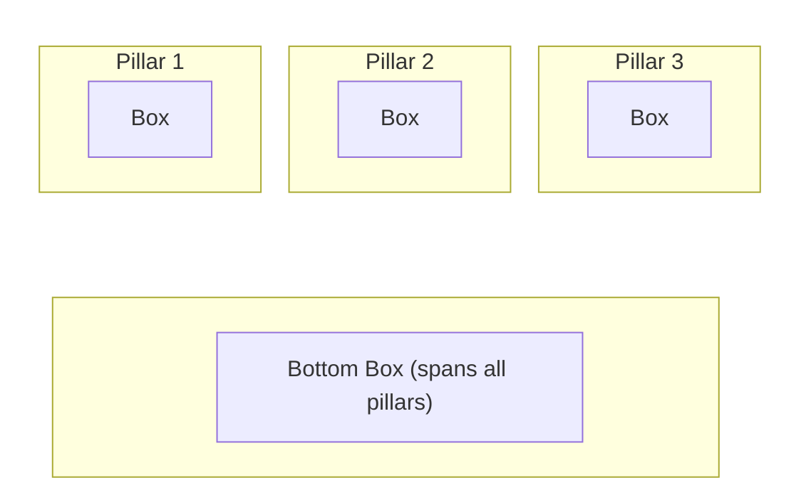

# Research

```mermaid
%%{init: {"theme":"default"} }%%
flowchart TB

subgraph TOP[" "]
  direction LR

  subgraph P1["Pillar 1"]
    A1["Box"]
  end

  subgraph P2["Pillar 2"]
    A2["Box"]
  end

  subgraph P3["Pillar 3"]
    A3["Box"]
  end
end

subgraph BOTTOM[" "]
  B["Bottom Box (spans all pillars)"]
end

%% force BOTTOM below the pillars (hide the lines)
A1 --- B
A2 --- B
A3 --- B

linkStyle 0 stroke:transparent,stroke-width:0;
linkStyle 1 stroke:transparent,stroke-width:0;
linkStyle 2 stroke:transparent,stroke-width:0;

%% hide only the TOP container border/background (keep BOTTOM visible)
style TOP fill:transparent,stroke:transparent;
```