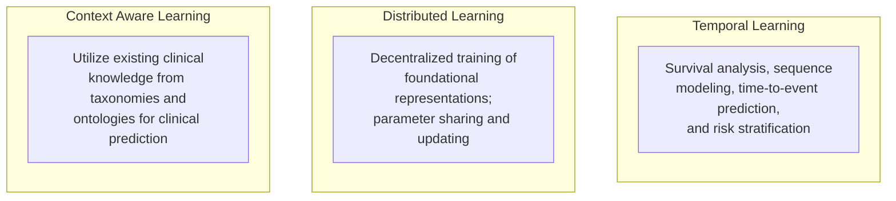

# Research

There are three main research pathways currently being investigated.

## Context Aware Learning

Utilize existing clinical knowledge from taxonomies and ontologies for clinical prediction.
- Knowledge graphs
- Graph neural networks
- Causality and counterfactuals
- Human-in-the-loop

## Distributed Learning

Decentralized training of foundational representations; parameter sharing and updating.
- Rare disease prediction
- Foundation models
- Federated learning
- Transfer learning

## Temporal Learning

Survival analysis, sequence modeling, time-to-event prediction, and risk stratification.
- Deep survival model
- Prescriptive modeling
- Generative transformer
